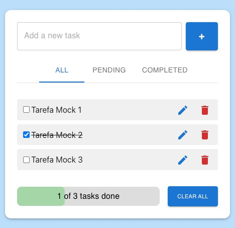
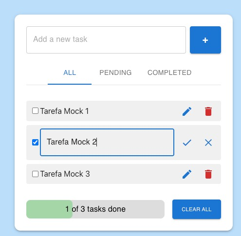

# To-Do List Application

## 1. Visão Geral

### Back-End
Desenvolvimento de uma API REST em **Kotlin** com **Spring Boot** para gerenciar uma lista de tarefas.  
A aplicação segue os princípios de **TDD (Test-Driven Development)** e boas práticas de **Clean Code**.

Cada tarefa deve conter os seguintes campos:
- **Título**
- **Descrição**
- **Prioridade** (baixa, média, alta)
- **Categoria** (string livre)
- **Status** (pendente ou concluído)

### Front-End
Desenvolvimento de uma interface web com **React + TypeScript + Tailwind CSS** para gerenciar as tarefas da To-Do List.  
A interface consome a API REST desenvolvida em Kotlin e deve ser totalmente responsiva, utilizando o padrão **Atomic Design** para organização dos componentes.

---

## 2. Endpoints e Testes Unitários

### 2.1 Endpoints

#### Criar Tarefa  
- **Endpoint:** `POST /tasks`  
- **Descrição:** Cria uma nova tarefa.  
- **Requisição:** Objeto JSON com informações da tarefa (`TaskRequestDTO`).  
- **Resposta:** Objeto JSON com detalhes da tarefa criada (`TaskResponseDTO`) e status HTTP **201 Created**.

#### Listar Tarefas  
- **Endpoint:** `GET /tasks`  
- **Descrição:** Retorna uma lista com todas as tarefas existentes.  
- **Requisição:** Não possui parâmetros.  
- **Resposta:** Array JSON contendo objetos com detalhes de cada tarefa (`TaskResponseDTO`).

#### Atualizar Status da Tarefa  
- **Endpoint:** `PATCH /tasks/{id}/status`  
- **Descrição:** Atualiza o status de uma tarefa específica.  
- **Parâmetros:**  
  - `id` (path variable): ID da tarefa a ser atualizada.  
  - `status` (query parameter): Novo status da tarefa.  
- **Resposta:**  
  - Objeto JSON com detalhes da tarefa atualizada (`TaskResponseDTO`) e status HTTP **200 OK** se a tarefa existir.  
  - Status HTTP **404 Not Found** se a tarefa não for encontrada.

#### Deletar Tarefa  
- **Endpoint:** `DELETE /tasks/{id}`  
- **Descrição:** Remove uma tarefa pelo seu ID.  
- **Parâmetros:**  
  - `id` (path variable): ID da tarefa a ser deletada.  
- **Resposta:** Status HTTP **204 No Content** em caso de sucesso.

---

### 2.2 Testes Unitários

#### Testes do Serviço de Tarefas (`TaskServiceTest`)  
- **Teste de Criação de Tarefa**  
  - **Método:** `test create task`  
  - **Descrição:** Verifica se a criação de tarefa funciona corretamente. Cria uma instância de `TaskService` e um objeto `TaskRequestDTO` com dados de teste.

#### Testes do Controlador de Tarefas (`TaskControllerTest`)  
- **Teste do Endpoint de Criação de Tarefa**  
  - **Método:** `test create task endpoint`  
  - **Descrição:** Valida o funcionamento do endpoint de criação de tarefa usando `MockMvc` para simular requisições HTTP.  
  - **Requisição:** POST para `/tasks` com JSON representando uma nova tarefa (`TaskRequestDTO`).
 
## Prints da Aplicação

### Print 1

### Print 2

---

